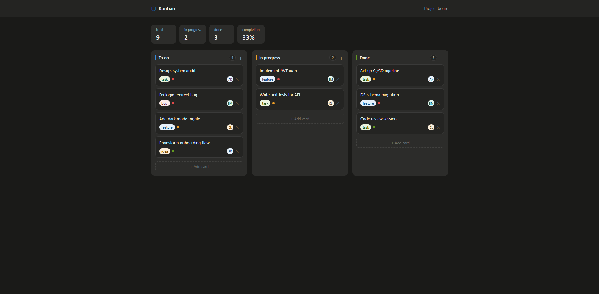

# Kanban Board

A drag-and-drop task management board built with React and Vite. No external UI libraries — pure React with CSS Modules.

## Features

- **Drag & drop** cards between columns (To do → In progress → Done)
- **Add cards** via the `+` button in each column or the ghost button at the bottom
- **Delete cards** with the ✕ button on hover
- **Tags** — task, feature, bug, idea
- **Priority** — high / medium / low (color-coded dot)
- **Assignee avatars** — randomly assigned on creation
- **Live stats** — total cards, in progress, done count, completion %
- **Dark mode** — respects `prefers-color-scheme`
- **Responsive** — single-column layout on mobile

## Tech stack

- React 18
- Vite 4
- CSS Modules (no Tailwind, no styled-components)
- Custom `useKanban` hook for all state logic

## Getting started

```bash
npm install
npm run dev
```

Open [http://localhost:5173](http://localhost:5173) in your browser.

## Project structure

```
src/
├── components/
│   ├── KanbanBoard.jsx      # Board layout, wires columns together
│   ├── KanbanColumn.jsx     # Single column with drag-over handling
│   ├── KanbanCard.jsx       # Draggable task card
│   ├── AddCardForm.jsx      # Inline form to create new cards
│   └── StatsBar.jsx         # Summary statistics
├── hooks/
│   └── useKanban.js         # All state: cards, drag, add, delete, move
├── styles/
│   └── index.css            # CSS variables, reset, base styles
├── constants.js             # Columns, tags, priorities, assignees
├── App.jsx
└── main.jsx
```

## How it works

All board state lives in the `useKanban` hook. Components are purely presentational — they receive data and callbacks as props. Drag-and-drop uses the native HTML5 Drag and Drop API (`draggable`, `onDragStart`, `onDrop`).

## Screenshots




## What I Learned

During this project I practiced:

* Building a React application with reusable components
* Managing board state with a custom React hook
* Working with the native HTML5 Drag and Drop API
* Creating dynamic task cards
* Moving cards between columns
* Calculating live board statistics
* Styling a responsive interface with CSS Modules

## Future Improvements

* Save board state in localStorage
* Add card editing
* Add task search
* Add filtering by tag and priority
* Add drag sorting inside the same column
* Add due dates for tasks
* Add tests
